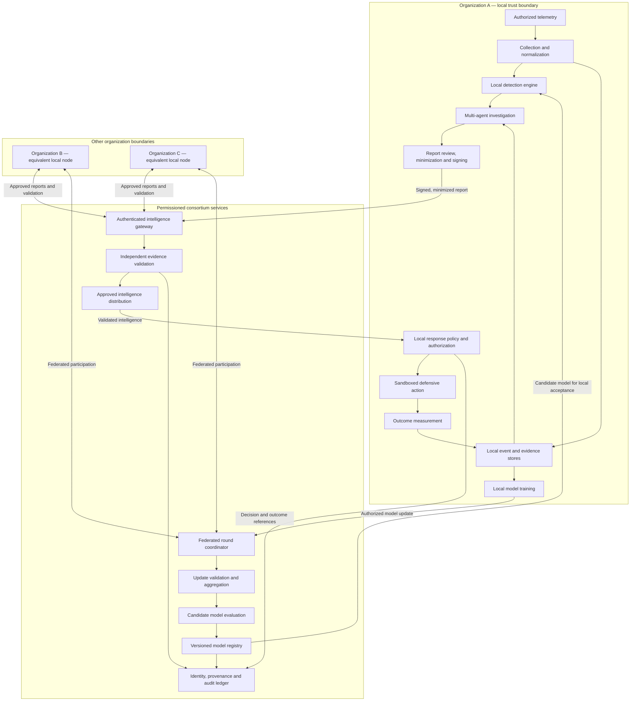
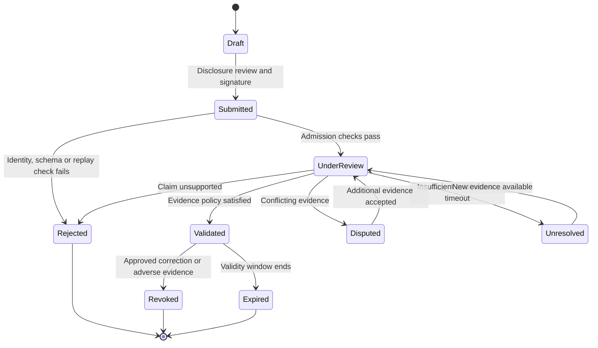
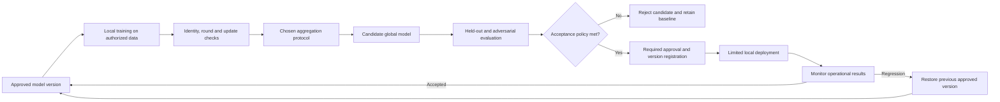

# AEGIS-Ω — Complete Hacktopia 2K26 Project Description

**Hacktopia 2K26 · Phase 1 Ideathon**

**AEGIS-Ω**

**A Decentralized Self-Evolving Cyber Defense Ecosystem Using Multi-Agent AI, Blockchain-Based Trust, and Adversarial Threat Intelligence**

**Core vision:** Build a collaborative cyber defense ecosystem in which multiple organizations can detect emerging cyber threats, validate intelligence from potentially compromised sources, learn collectively without exposing sensitive data, and coordinate secure defensive responses through a decentralized trust and accountability layer.

**Central innovation:** A closed-loop defense system that continuously improves through verified threat intelligence and measured defensive outcomes, while resisting malicious participants, poisoned intelligence, and unsafe autonomous actions.

I've structured the project according to the 12 sections in your Hacktopia template, covering problem understanding, existing gaps, proposed solution, innovation, workflow, technology stack, architecture, features, feasibility, impact, and future scope.

`hacktopia ppt temp.pptx`

The design combines the most relevant architectural ideas from the repositories we discussed: multi-agent security operations, federated learning, decentralized threat intelligence, on-chain trust and challenge mechanisms, controlled response authorization, and tamper-evident auditing. These are proposed as an integrated system; the complete AEGIS-Ω platform itself is not an existing, validated implementation.

> **Project stage: proposed research prototype.** The original project description is preserved in full. Expanded architecture and validation sections describe a proposed implementation; no deployment or benchmark results are claimed.

## Explore the project

| Understand the idea | Inspect the design | Plan the implementation |
| --- | --- | --- |
| [Project identity](#section-01) | [Proposed solution](#section-04) | [Technology stack](#section-07) |
| [Problem understanding](#section-02) | [Innovation](#section-05) | [Implementation plan](#section-10) |
| [Existing challenges](#section-03) | [End-to-end workflow](#section-06) | [Impact and evaluation](#section-11) |
| [Key features](#section-09) | [System architecture](#section-08) | [Future scope](#section-12) |
| [Project abstract](#project-abstract) | [Detailed architecture diagrams](#detailed-architecture) | [Demonstration blueprint](#demonstration-blueprint) |

**Architecture reading path:** deployment boundaries → component contracts → incident sequence → report lifecycle → data placement → learning and model promotion → response authorization → implementation decisions.

---

<a id="section-01"></a>

## 01. Project identity

#### PROJECT NAME

AEGIS-Ω

#### PROBLEM STATEMENT

Development of a Decentralized Self-Evolving Cyber Defense Ecosystem Using Multi-Agent AI, Blockchain-Based Trust, and Adversarial Threat Intelligence.

- Team name: [Enter Team Name]

- Team leader: [Enter Name]

- College / Institution: [Enter Institution]

- Team members: [Enter Member Names]

<a id="section-02"></a>

## 02. Problem understanding

### 2.1 Problem overview

Modern cybersecurity infrastructure is becoming increasingly interconnected, distributed, and dependent on digital services. Organizations such as financial institutions, healthcare providers, educational institutions, enterprises, cloud service providers, and government agencies face a constantly evolving landscape of cyber threats, including ransomware, credential compromise, malware, insider misuse, supply-chain attacks, and previously unseen attack patterns.

Although organizations deploy firewalls, intrusion detection systems, endpoint protection, security information and event management platforms, and threat intelligence services, their defensive capabilities frequently operate within organizational boundaries. Each organization observes only a limited portion of the broader threat landscape, while critical intelligence about emerging attacks remains fragmented across isolated security environments.

This fragmentation creates a major weakness: an attack detected by one organization may remain unknown to another organization until the same attacker has already exploited the second environment.

Conventional threat intelligence sharing attempts to address this problem, but centralized platforms can introduce dependencies on trusted intermediaries, while unverified or manipulated reports can spread false indicators and misleading security decisions. At the same time, machine learning models trained on historical attack data may struggle to recognize changing attack behaviors, and conventional security automation often depends on predefined rules that cannot adequately adapt to unfamiliar situations.

The fundamental problem is not merely detecting cyberattacks; it is enabling independent organizations to collectively detect, verify, learn from, and respond to evolving threats without blindly trusting one another or exposing sensitive internal data.

AEGIS-Ω addresses this challenge through a decentralized cyber defense ecosystem in which autonomous AI agents analyze threats, blockchain-backed mechanisms establish accountability, privacy-preserving collaborative learning improves detection, and controlled response mechanisms translate verified intelligence into coordinated defensive action.

### 2.2 Who is affected?

#### Enterprise security teams and SOC analysts

Face large volumes of security alerts, fragmented intelligence, false positives, and the challenge of correlating incidents across multiple systems.

#### Healthcare institutions and critical service providers

Need to protect sensitive information and maintain operational continuity while responding to threats that may affect interconnected systems.

#### Cloud providers and digital infrastructure operators

Manage distributed assets and identities, where an incident in one environment may create risks for connected services.

#### Small and medium-sized organizations

May lack the resources to maintain dedicated threat intelligence teams, advanced security operations, and continuous model development.

#### Cybersecurity researchers and incident response teams

Need trustworthy evidence, reliable threat intelligence, and mechanisms to investigate coordinated attacks across independent environments.

### 2.3 Why does it matter?

Cyberattacks increasingly affect interconnected digital ecosystems rather than isolated devices. A single compromised credential, vulnerable software component, or malicious update can create risks across multiple systems.

The consequences include:

- Financial losses, operational disruption, and recovery costs.

- Exposure of sensitive organizational and personal data.

- Reduced trust in shared threat intelligence when reports are inaccurate or manipulated.

- Delayed response when threat information remains fragmented.

- Increased difficulty identifying coordinated attacks across organizations.

- Potential damage caused by automated security actions based on incomplete or unreliable evidence.

AEGIS-Ω aims to shift cybersecurity from isolated, reactive protection toward collaborative, verifiable, adaptive defense.

### 2.4 Supporting data / statistics

For the submission, this section should use verified and dated cybersecurity statistics relevant to the target population. No numerical statistic is inserted here because the template's extracted content does not provide one and no independently verified statistic is being used in this draft.

<a id="section-03"></a>

## 03. Existing challenges / problem gap

### 3.1 Current challenges

#### Challenge 1 — Fragmented threat intelligence

Organizations independently collect logs, indicators of compromise, attack signatures, and incident reports. Without effective sharing and correlation, the same threat may be detected repeatedly across different organizations, increasing the time required to recognize broader attack campaigns.

#### Challenge 2 — Lack of reliable intelligence verification

Threat reports may contain incomplete, outdated, inaccurate, or deliberately manipulated information. If organizations accept intelligence without validating its source and supporting evidence, malicious participants can introduce false indicators or trigger unnecessary defensive actions.

#### Challenge 3 — Static and reactive security models

Conventional detection systems often rely on predefined rules, signatures, or models trained on historical datasets. Such systems may fail to recognize new behavioral patterns or adapt rapidly to changing attack techniques.

#### Challenge 4 — Privacy barriers to collaborative learning

Organizations are often unable or unwilling to share raw network traffic, internal logs, customer data, or proprietary security information. This restricts the ability to build collaborative detection models using insights from multiple environments.

#### Challenge 5 — Limited coordination between security tools

Detection systems, threat intelligence platforms, investigation tools, and response engines frequently operate as separate components. This creates delays between discovering a threat, validating its credibility, and executing an appropriate defensive action.

#### Challenge 6 — Risk of compromised participants

A decentralized network introduces an additional security challenge: participating organizations or intelligence sources may themselves be compromised. A malicious participant could submit false reports, manipulate trust mechanisms, or attempt to poison collaborative learning models.

### 3.2 Existing approaches

| Existing approach | Primary purpose |
| --- | --- |
| SIEM and intrusion detection | Collect events, detect suspicious activity, and generate alerts |
| Threat intelligence platforms | Collect, correlate, and share threat indicators |
| Federated learning | Train models across multiple organizations without centralizing raw data |
| Blockchain audit systems | Maintain tamper-evident records of events and decisions |
| Multi-agent AI systems | Divide analysis and response tasks among specialized agents |
| Zero Trust security | Continuously evaluate access and enforce security policies |

These approaches address different aspects of cybersecurity, but combining them into a coordinated, privacy-preserving, adversarially resilient system requires additional architecture and validation.

### 3.3 Limitations

- Centralized intelligence services can become critical dependencies and may not satisfy every organization's trust requirements.

- Blockchain can provide tamper-evident records but cannot independently establish whether a submitted threat report is truthful.

- Federated learning reduces the need to exchange raw data but does not automatically prevent malicious model updates or information leakage.

- Multi-agent AI can improve task specialization, but agents may produce inconsistent or incorrect conclusions.

- Automated response can reduce delays, but poorly controlled actions can interrupt legitimate operations.

- Reputation systems can be manipulated through collusion, fabricated identities, or strategic behavior.

### 3.4 Identified gap

There is a need for a decentralized, privacy-preserving, and adversarially resilient cyber defense ecosystem that unifies multi-agent threat analysis, verifiable intelligence sharing, collaborative model learning, and controlled adaptive response within one accountable feedback loop.

AEGIS-Ω targets this gap by combining:

- Multi-agent analysis and independent evidence corroboration.

- Blockchain-backed identity, provenance, and trust accountability.

- Privacy-preserving collaborative threat detection.

- Adversarial validation against malicious intelligence and poisoned model updates.

- Policy-controlled defensive actions.

- Continuous learning from verified outcomes.

<a id="section-04"></a>

## 04. Proposed solution

### 4.1 Solution overview

AEGIS-Ω (Adaptive Ecosystem for Guarded Intelligence and Security) is a proposed decentralized, multi-organization cyber defense platform that enables participating organizations to detect cyber threats locally, exchange verifiable threat intelligence, collaboratively improve detection models, and coordinate defensive responses through a distributed trust framework.

The platform combines six major capabilities:

- Distributed threat detection: Each organization runs a local security monitoring engine that analyzes network events, system logs, and behavioral patterns to identify suspicious activity.

- Multi-agent threat investigation: Specialized AI agents independently investigate alerts, correlate evidence, assess attack patterns, and produce structured threat assessments.

- Decentralized intelligence verification: Threat reports are digitally signed, checked for provenance, evaluated against independent evidence, and recorded through a blockchain-backed trust mechanism.

- Privacy-preserving collaborative learning: Organizations contribute to shared detection models through federated learning, allowing collective improvement without transferring raw network data.

- Controlled autonomous defense: A policy-driven response engine evaluates verified threat intelligence and executes authorized containment actions in isolated or approved environments.

- Outcome-driven self-evolution: The system evaluates whether its detections and responses were effective, incorporates verified feedback into model and policy updates, and maintains an auditable history of changes.

Unlike a conventional security platform that operates as a standalone detection and response system, AEGIS-Ω treats cybersecurity as a collaborative process in which independent participants contribute intelligence, verify evidence, improve collective knowledge, and coordinate defense without requiring a single organization to control the entire network.

### 4.2 Proposed approach

#### A. Local intelligence and threat detection

Each participating organization deploys a local security node that collects relevant telemetry from its own environment. This may include network flow records, authentication events, endpoint alerts, system logs, and application activity.

The local detection engine processes these signals to identify suspicious behavior such as unusual connection patterns, abnormal authentication activity, suspicious process execution, or indicators associated with known threats.

Rather than transferring raw telemetry to a central platform, the node generates a structured security event containing the relevant indicators, confidence level, supporting evidence references, and a cryptographic signature.

#### B. Multi-agent threat investigation

When a suspicious event is detected, an orchestrator assigns the investigation to specialized AI agents.

| Agent | Responsibility |
| --- | --- |
| Detection Agent | Identifies suspicious activity from local telemetry |
| Intelligence Agent | Enriches alerts using threat intelligence sources |
| Correlation Agent | Links related indicators, events, and attack sequences |
| Verification Agent | Checks evidence quality, provenance, and corroboration |
| Risk Agent | Evaluates severity, confidence, and potential operational impact |
| Defense Agent | Recommends a policy-compliant defensive response |
| Learning Agent | Evaluates outcomes and prepares validated model or policy updates |

The agents exchange structured findings through a controlled coordination mechanism. Their outputs are not automatically treated as ground truth; evidence quality, uncertainty, and conflicting findings are explicitly considered.

#### C. Blockchain-backed decentralized trust

Each participating organization receives a cryptographically verifiable identity. Threat reports and intelligence contributions are digitally signed and associated with their originating organization.

A permissioned blockchain maintains records of:

- Participant identities and authorization status.

- Threat report hashes and provenance.

- Validation and corroboration outcomes.

- Reputation changes and disputes.

- Model update versions and approvals.

- Defensive decision records and audit events.

The blockchain serves as an accountability and coordination layer rather than a repository for raw logs or sensitive telemetry.

A trust mechanism evaluates contributors based on evidence quality, historical validation outcomes, consistency, and verified misconduct. Disputed reports can enter a challenge process in which additional evidence is requested and independent participants validate the submission.

#### D. Privacy-preserving collaborative learning

Each organization trains or fine-tunes its local detection model using its own authorized data. Instead of sharing raw network records, participating nodes contribute model updates through a federated learning process.

A coordinating mechanism validates participant identities, checks update integrity, evaluates suspicious updates, and aggregates accepted contributions into a shared model.

The system can use robust aggregation, update clipping, anomaly screening, and secure aggregation to reduce the impact of malicious or unreliable contributions.

The resulting global model is distributed to participating nodes, where it is evaluated before deployment.

#### E. Policy-controlled autonomous response

After intelligence has been evaluated, the defense engine determines whether an action is justified.

Potential actions include:

- Raising an alert for human review.

- Increasing monitoring on a suspicious asset.

- Restricting a test account's access.

- Quarantining a simulated compromised endpoint.

- Blocking a verified malicious indicator in an approved test environment.

- Initiating a controlled incident investigation.

The system applies authorization policies based on threat confidence, asset criticality, evidence quality, and operational risk. High-impact actions require appropriate human approval.

#### F. Self-evolution and continuous improvement

After a defensive action, the system evaluates the outcome using subsequent telemetry, analyst feedback, controlled test results, and verified incident labels.

Validated feedback can inform:

- Detection model retraining.

- Threat intelligence reputation updates.

- Improvements to investigation workflows.

- Changes to response thresholds and policies.

- Updates to agent instructions and orchestration rules.

Every proposed update passes through validation, testing, versioning, and rollback controls before deployment.

> This creates a closed-loop process: Detect → Investigate → Verify → Coordinate → Defend → Measure → Improve.

### 4.3 How the solution addresses the problem

| Identified problem | AEGIS-Ω solution | Expected result |
| --- | --- | --- |
| Fragmented intelligence | Shared, structured threat intelligence | Improved cross-organization visibility |
| False or manipulated reports | Signed provenance, corroboration, and dispute handling | More accountable intelligence sharing |
| Static detection models | Federated learning and validated feedback | Continuous improvement of detection capability |
| Data privacy barriers | Local training and privacy-preserving aggregation | Collaboration without centralizing raw telemetry |
| Slow incident coordination | Multi-agent investigation and policy-driven response | More consistent and timely workflows |
| Compromised participants | Trust evaluation and adversarial update screening | Reduced influence of malicious contributions |
| Uncontrolled automation | Authorization policies and human oversight | Safer defensive execution |

<a id="section-05"></a>

## 05. Innovation and unique value proposition

### 5.1 Key innovation

#### Innovation 1 — Trust-aware autonomous threat intelligence

AEGIS-Ω does not treat every threat report as equally reliable. Each contribution is associated with a verifiable source, supporting evidence, and a validation history.

The network combines cryptographic provenance, independent corroboration, and reputation-based accountability to distinguish between verified intelligence, uncertain reports, and disputed contributions.

#### Innovation 2 — Adversarially resilient collaborative learning

The platform enables organizations to learn from one another while limiting exposure of raw network data.

Unlike a basic federated learning setup, AEGIS-Ω incorporates participant validation, suspicious update screening, robust aggregation, and model evaluation to reduce the impact of malicious or compromised contributors.

#### Innovation 3 — Multi-agent investigation with evidence-based coordination

Instead of relying on a single AI agent to make a complete security decision, the platform separates investigation into specialized tasks.

Independent agents examine different aspects of an incident, while an orchestrator combines their findings, checks for contradictions, and produces a structured assessment with confidence and evidence references.

#### Innovation 4 — Controlled self-evolving defense

AEGIS-Ω creates a feedback loop in which verified outcomes improve future detection and response decisions.

The system does not automatically rewrite its own security logic without validation. Model updates and policy changes are versioned, tested, and governed through explicit approval mechanisms.

#### Innovation 5 — Verifiable decentralized accountability

The platform records signed intelligence submissions, validation outcomes, trust changes, and response decisions in a tamper-evident audit trail.

This allows participating organizations to inspect how a security decision was reached and verify whether the relevant records were modified.

### 5.2 What makes it different?

| Dimension | Conventional approach | AEGIS-Ω |
| --- | --- | --- |
| Threat intelligence | Centralized sharing or independent feeds | Distributed, verifiable intelligence exchange |
| Intelligence trust | Source reputation or manual verification | Provenance, corroboration, and challenge mechanisms |
| Threat analysis | Rules and individual detection engines | Coordinated multi-agent investigation |
| Model improvement | Central retraining or isolated models | Federated learning with adversarial screening |
| Response | Separate automation workflows | Verified, policy-controlled coordination |
| Auditability | Central logs or individual audit systems | Shared, tamper-evident records |
| Adaptation | Manual tuning and periodic updates | Validated feedback-driven model and policy improvement |

### 5.3 Unique value proposition

AEGIS-Ω transforms isolated security operations into a collaborative, verifiable, and adaptive defense ecosystem.

Its value lies in enabling organizations to benefit from collective threat intelligence and collaborative learning while maintaining control over sensitive data, preserving accountability, and limiting the influence of malicious participants.

The proposed platform aims to help security teams improve threat visibility, investigate incidents more consistently, validate shared intelligence, and respond through controlled, evidence-based workflows.

<a id="section-06"></a>

## 06. How the solution works — End-to-end workflow

### 6.1 Complete operational workflow

#### STEP 1 — Local data collection

Each organization collects authorized security telemetry from its own environment.

#### STEP 2 — AI-based anomaly detection

Local ML models identify suspicious behavior and generate structured security events.

#### STEP 3 — Multi-agent investigation

Specialized agents enrich, correlate, and assess the incident using available evidence.

#### STEP 4 — Signed intelligence submission

The organization signs a structured threat report and submits it to the shared intelligence network.

#### STEP 5 — Decentralized validation

Independent participants corroborate the evidence; trust mechanisms flag suspicious or disputed reports.

#### STEP 6 — Blockchain-backed coordination

Validated reports, provenance, trust events, and authorization records are anchored in a permissioned ledger.

#### STEP 7 — Collaborative learning

Participating nodes contribute screened federated model updates, which are aggregated and evaluated.

#### STEP 8 — Risk-based response

The response engine selects an authorized action based on evidence quality, confidence, and asset criticality.

#### STEP 9 — Outcome measurement

The system measures detection quality, response outcomes, false positives, and operational impact.

#### STEP 10 — Validated self-evolution

Validated feedback updates models and response policies through versioned, tested, and reversible workflows.

### 6.2 Example scenario

Consider three participating organizations: a hospital, a financial institution, and a cloud service provider.

- The hospital's local detection engine identifies unusual network behavior associated with a suspicious endpoint.

- Its AI investigation agents correlate the event with suspicious authentication activity and generate a threat report.

- The hospital signs the report and shares its indicators and evidence references with the decentralized network, without exposing raw patient data or complete internal logs.

- Independent nodes evaluate the report, compare available indicators, and identify corroborating or conflicting evidence.

- The validated intelligence is shared with the financial institution and cloud provider.

- The financial institution's local model detects related activity in its own environment, while the cloud provider identifies a potentially affected test workload.

- The response engine recommends restricting the affected test workload and increasing monitoring of related assets, subject to each organization's authorization policies.

- The incident outcomes are recorded, and validated feedback is used to improve future detection and response.

This scenario illustrates the intended collaboration model. It does not assume that one organization's threat report automatically proves that another organization is compromised.

<a id="section-07"></a>

## 07. Technology stack

The following stack is proposed for a practical prototype. The technologies are selected to support modular development, distributed trust, machine learning, and secure coordination.

### 7.1 Frontend

| Technology | Purpose |
| --- | --- |
| React.js | Interactive security operations dashboard |
| TypeScript | Type-safe frontend development |
| Tailwind CSS | Responsive interface design |
| Recharts | Threat trends, incident metrics, and model performance visualizations |
| React Flow | Visualization of agent workflows and attack graphs |

**Dashboard capabilities:** Live security alerts, organization-level threat views, agent investigation traces, intelligence validation status, trust history, model versions, and response approval controls.

### 7.2 AI / ML

| Technology | Purpose |
| --- | --- |
| Python | Core ML and analytics implementation |
| PyTorch | Neural network models and model experimentation |
| Scikit-learn | Baseline anomaly detection and classification |
| XGBoost | Structured network and event classification |
| Flower | Federated learning orchestration |
| NetworkX | Attack graphs and incident correlation |
| LangGraph | Multi-agent workflow orchestration |

#### Proposed AI architecture

- Local anomaly detection models analyze each organization's telemetry.

- Multi-agent workflows coordinate incident investigation and intelligence enrichment.

- Federated learning enables collaborative model improvement.

- Robust aggregation and anomaly screening help identify suspicious model updates.

- An outcome evaluation engine measures whether new models improve detection quality.

### 7.3 Backend

| Technology | Purpose |
| --- | --- |
| FastAPI | Backend APIs and security service endpoints |
| Python | Detection, intelligence processing, and orchestration |
| Hyperledger Fabric | Permissioned blockchain coordination and audit records |
| Fabric chaincode | Trust policies, report lifecycle, and authorization rules |
| gRPC / REST | Communication between organizational nodes |
| Celery / Redis | Background tasks and asynchronous processing |

### 7.4 Cloud / APIs

| Technology | Purpose |
| --- | --- |
| Docker | Containerized services and organization-level nodes |
| Docker Compose | Local multi-organization deployment |
| Kubernetes | Future distributed deployment |
| STIX/TAXII | Structured threat intelligence exchange |
| OpenTelemetry | Distributed observability and system tracing |
| Prometheus / Grafana | Infrastructure monitoring and performance metrics |

### 7.5 Database

| Technology | Purpose |
| --- | --- |
| PostgreSQL | Incident metadata, organization records, and application state |
| Redis | Caching, task coordination, and short-lived state |
| Object storage | Encrypted evidence artifacts and model files |
| Hyperledger Fabric ledger | Shared trust records and audit events |
| Local event store | Organization-specific telemetry and detection records |

**Data protection principle:** Raw security telemetry and sensitive evidence remain under the control of the originating organization. The shared ledger stores only the minimum information needed for verification, coordination, and accountability.

### 7.6 IoT / Hardware

No specialized hardware is required for the initial prototype.

The system can run on ordinary computers or virtual machines, with simulated enterprise networks and containerized endpoints. Later versions may integrate endpoint monitoring agents, network sensors, or industrial IoT devices.

<a id="section-08"></a>

## 08. System architecture

### 8.1 Architectural overview

AEGIS-Ω follows a decentralized, modular architecture consisting of five logical layers:

- Organization layer: Local security telemetry, identity, detection, and data ownership.

- Intelligence layer: Multi-agent investigation, evidence correlation, and threat report generation.

- Trust layer: Blockchain-backed provenance, participant authorization, validation records, and reputation.

- Learning and coordination layer: Federated learning, robust aggregation, and cross-organization intelligence distribution.

- Defense and adaptation layer: Risk assessment, response authorization, controlled execution, and validated learning from outcomes.

Each organization operates its own local node, while participating nodes exchange approved intelligence and coordination messages through authenticated communication channels.

### 8.2 Major system components

#### ORGANIZATION A / B / C

Local security environment · Data ownership · Participant identity

#### LOCAL DEFENSE NODE

- Telemetry collector

- Local ML detection engine

- Security event processor

- Evidence and report generator

- Local model trainer

- Policy-controlled response agent

#### MULTI-AGENT INTELLIGENCE ENGINE

- Investigation orchestrator

- Intelligence enrichment agent

- Correlation agent

- Verification agent

- Risk assessment agent

- Defense planning agent

#### DECENTRALIZED TRUST NETWORK

- Permissioned blockchain

- Participant identity and authorization

- Signed threat report registry

- Reputation and dispute mechanism

- Audit and governance records

#### COLLABORATIVE LEARNING AND COORDINATION

- Federated learning coordinator

- Model update screening

- Robust aggregation

- Model evaluation and versioning

- Verified intelligence distribution

#### DEFENSE, FEEDBACK AND AUDIT

- Risk-based response engine

- Human approval interface

- Controlled execution

- Outcome measurement

- Validated model and policy updates

- Tamper-evident audit history

### 8.3 How the components interact

#### Local security nodes

Each organization collects and analyzes its own telemetry. It decides what information may be shared and retains control over its sensitive records.

#### Multi-agent investigation engine

The orchestrator coordinates specialized agents and receives their structured findings. The engine records evidence references, uncertainty, and disagreements instead of treating every model output as a verified fact.

#### Decentralized trust network

The permissioned blockchain records signed submissions, validation decisions, and authorized state changes. Participant identity and endorsement policies determine which organizations may submit, validate, or approve specific actions.

#### Collaborative learning engine

Local models train on organization-specific data. The learning coordinator collects approved updates, screens for suspicious behavior, aggregates accepted contributions, and distributes candidate model versions for evaluation.

#### Defense and feedback engine

The response engine evaluates threat evidence and organizational policy before initiating an action. Outcome measurements feed into a controlled improvement process.

### 8.4 Trust and governance model

The proposed network uses a permissioned consortium model in which participating organizations have verified identities and defined responsibilities.

- Organizations control their own local data.

- Authorized participants submit and validate intelligence.

- Trust scores are evidence-based and auditable.

- Disputed reports enter a defined review process.

- High-impact defensive actions remain subject to explicit authorization.

- Ledger records are replicated and independently verifiable according to the consortium's governance rules.

A permissioned blockchain is proposed because the initial system requires known participants, controlled access, and organizational accountability. The specific consensus protocol and fault tolerance must be selected and tested during implementation.

<a id="detailed-architecture"></a>

### 8.5 Detailed deployment architecture

> **Proposed design elaboration:** Sections 8.5–8.12 expand the original architecture into an implementation blueprint. They describe intended behavior and design decisions to validate; they do not represent an implemented or benchmarked platform.

The deployment separates organization-owned processing from consortium coordination. Each organization operates the same local node pattern, retains its raw telemetry, and decides which derived information may leave its boundary. Shared services coordinate approved contributions; they do not receive unrestricted access to local evidence or response tools.



**Reading the architecture:** detection and response remain local. Cross-organization messages pass through an authenticated, policy-controlled interface. The consortium ledger records accountable decisions and references; evidence storage, model training, inference, and defensive execution remain separate services.

The federated coordinator is a designated service in the initial prototype. This is a coordination dependency to document and test. A permissioned ledger alone does not make every component decentralized or remove coordinator availability and governance risks.

### 8.6 Component responsibilities and contracts

| Component | Receives | Produces | Required boundary |
| --- | --- | --- | --- |
| Telemetry collector | Authorized logs, events and network metadata | Normalized events with source and time information | Local access policies determine collection and retention |
| Detection engine | Normalized local events and approved model version | Alert, confidence, evidence references and model version | A detection is a hypothesis requiring investigation |
| Investigation orchestrator | Alert and permitted evidence | Agent tasks and a consolidated assessment | Enforces task limits and preserves contradictory findings |
| Verification Agent | Claims, provenance and evidence references | Supported, unsupported or unresolved findings | Source identity does not substitute for evidence |
| Report gateway | Minimized signed report | Submission acknowledgment or validation error | Checks identity, schema, authorization, freshness and duplication |
| Consortium validators | Shared report and accessible evidence | Independent validation decisions and reasons | Restricted evidence cannot be assumed verified |
| Trust registry | Authorized decisions and dispute outcomes | Versioned provenance and reputation history | Reputation informs review; it cannot bypass response policy |
| Learning coordinator | Round membership and approved updates | Candidate aggregation and round metadata | Rejects incompatible, replayed or unauthorized contributions |
| Model registry | Evaluated model artifact and approvals | Versioned candidate or approved release | Local deployment requires an explicit acceptance gate |
| Response engine | Validated assessment and local policy | Approved action request or escalation | Only allowlisted actions against authorized local targets |
| Outcome evaluator | Post-action observations and reviewed labels | Measured outcome and candidate feedback | Unreviewed agent opinions do not become trusted training labels |
| Dashboard | Authorized incident, model and audit views | Analyst reviews and approval requests | The backend independently enforces every permission |

### 8.7 End-to-end incident sequence

```mermaid
sequenceDiagram
    autonumber
    participant N as Local node
    participant A as Investigation agents
    participant G as Intelligence gateway
    participant V as Independent validators
    participant L as Consortium ledger
    participant P as Peer organization
    participant H as Authorized reviewer
    N->>A: Alert, model version and scoped evidence
    A->>A: Enrich, correlate, verify and assess risk
    A-->>N: Structured assessment with uncertainty
    N->>N: Minimize disclosure and sign report
    N->>G: Submit authenticated threat report
    G->>G: Check schema, identity, freshness and replay
    G->>V: Request independent corroboration
    V-->>G: Evidence-linked decisions
    alt Validation policy satisfied
        G->>L: Record validation and provenance references
        G->>P: Distribute validated intelligence
        P->>P: Reassess local evidence and response policy
        opt Action requires human authorization
            P->>H: Proposed target, action, evidence and rollback
            H-->>P: Approve or reject scoped action
        end
        P->>P: Execute only if authorized; measure outcome
        P->>L: Record decision and outcome references
    else Conflicting or insufficient evidence
        G->>L: Record disputed or unresolved status
        G-->>N: Request further evidence or issue rejection
    end
```

A peer organization receives intelligence, not an instruction to execute a command. It must correlate the report with its own environment and apply its own authorization policy. The outcome of validation and the authority to act are separate decisions.

### 8.8 Threat report lifecycle



Validation is time-sensitive. An indicator accepted during one incident should not remain indefinitely actionable. Expiry, correction and revocation events should propagate to consumers, while the earlier decision history remains available for audit. Downstream nodes should record which report version supported each response.

**Proposed report contract:** the following fields define a design target, not a published API.

| Field group | Proposed fields | Purpose |
| --- | --- | --- |
| Identity | `report_id`, `schema_version`, `organization_id`, `signing_key_id` | Identify the submission, format and accountable source |
| Timing | `observed_at`, `submitted_at`, `expires_at` | Evaluate ordering, freshness and useful lifetime |
| Threat description | `indicator_type`, `indicator_value`, `observed_behavior` | Describe the claim without exporting full telemetry |
| Assessment | `confidence`, `severity`, `uncertainty`, `model_version` | Preserve the assessment and the basis on which it was generated |
| Evidence | `evidence_refs`, `evidence_hashes`, `disclosure_policy` | Link authorized reviewers to integrity-checkable evidence |
| Integrity | `payload_hash`, `signature`, `nonce` | Bind the source to a defined payload and support replay checks |
| Lifecycle | `status`, `validation_refs`, `supersedes_report_id` | Track review, correction and downstream dependencies |

Before implementation, specify canonical serialization, the exact signed fields, signature algorithms, clock tolerance, identifier rules and schema evolution. Confidence values also need a defined interpretation; values from different models should not be treated as directly comparable without calibration.

### 8.9 Data placement and disclosure controls

| Data | Intended location | Sharing rule |
| --- | --- | --- |
| Raw logs and network telemetry | Originating organization's local event store | Remain local under the original design |
| Detailed investigation evidence | Local encrypted evidence storage | Access only when explicitly permitted; a reference does not grant access |
| Sanitized threat report | Authorized intelligence service and permitted peers | Minimize identifying or sensitive fields before submission |
| Report hash and validation reference | Consortium ledger | Commit only metadata approved for consortium visibility |
| Model update | Authorized learning workflow | Screen and protect according to the chosen round protocol |
| Model artifact | Versioned model registry | Distribute only approved versions to authorized participants |
| Response decision | Local audit record with selected ledger references | Preserve actor, policy, target and supporting report version |
| Secrets and signing keys | Organization-controlled secret storage | Never publish in reports, prompts, model metadata or ledger records |

Hashes do not make their underlying inputs anonymous. Short or guessable indicators can remain discoverable, and participant identities, timestamps or repeated references may disclose relationships. The implementation should review metadata exposure as well as raw data exposure.

Retention, deletion and correction policies belong at the data-owning organization and consortium governance levels. Sensitive content should not be written into an immutable record on the assumption that it can be removed later.

### 8.10 Federated learning and controlled self-evolution



**A learning round should be reproducible.** Record the starting model, eligible participants, dataset split policy, training configuration, update checks, aggregation method, evaluation results, approval and final artifact hash. A failed or incomplete round should leave the last approved model available.

**Resolve the privacy–inspection tradeoff explicitly.** Individual-update anomaly screening requires visibility into individual updates. Secure aggregation can intentionally hide those updates from the coordinator. The implementation must choose a compatible protocol rather than assume unrestricted screening and hidden individual updates can be combined automatically. An initial experiment may evaluate transparent screened aggregation and a separate secure-aggregation configuration, documenting the distinct trust assumptions of each.

**Feedback requires provenance.** Separate analyst-confirmed labels, controlled test labels and unconfirmed model predictions. Only feedback satisfying the chosen validation policy should influence released models or response policies. This avoids treating repeated agreement between agents as independent proof.

**Promotion requires measured evidence.** Compare candidate models against the same approved baseline using held-out evaluation data and defined operating conditions. Include false positives, detection quality, resource use and performance under malicious contributions. Acceptance thresholds should be declared before the experiment; no numerical target is claimed as achieved in this document.

### 8.11 Response authorization and operational recovery

| Proposed action category | Example | Authorization gate | Recovery requirement |
| --- | --- | --- | --- |
| Observation | Raise an incident or increase approved monitoring | Local policy and permitted telemetry scope | Expire temporary monitoring and record closure |
| Reversible containment in a sandbox | Quarantine a simulated endpoint | Valid evidence, allowlisted target and policy approval | Defined release operation and bounded duration |
| Disruptive containment | Restrict an account or block a workload | Explicit approval from an authorized reviewer when impact requires it | Capture the prior state and verify restoration |
| Model or policy deployment | Promote a candidate detection model | Evaluation, versioning and required release approval | Retain the previous approved version and test rollback |

An action request should bind the action type, target, parameters, evidence references, policy version, approval identity and expiry. Approval for one target or action must not authorize a broader action after the request changes. Repeated delivery should not execute the same action more than once.

| Failure or adversarial condition | Intended behavior |
| --- | --- |
| Shared ledger unavailable | Continue permitted local monitoring; defer actions requiring unavailable consortium authorization and record reconciliation work |
| Contradictory agent findings | Preserve disagreement, lower certainty where appropriate and request further review |
| Compromised participant identity | Suspend new contributions under governance policy, review affected reports and rotate credentials |
| Validator timeout | Mark the report unresolved; do not silently interpret missing decisions as approval |
| Duplicate or replayed report | Detect prior submission or reused freshness material and avoid repeated downstream effects |
| Poisoned or incompatible update | Reject or quarantine it; retain the current approved model |
| Response execution timeout | Reconcile the actual target state before retrying or declaring success |
| Candidate model regression | Stop promotion or restore the prior version; retain the failed candidate's evaluation record |

Local protection must have a documented fallback policy. Any permitted action during a consortium outage should derive from existing local authorization, not from pretending that a missing shared decision succeeded.

### 8.12 Implementation scope and architecture decisions

| Design area | Initial prototype decision | Later validation or extension |
| --- | --- | --- |
| Participants | Three simulated organizations with distinct identities and data stores | Onboarding, removal and governance across independent operators |
| Deployment | Containerized services on a controlled development environment | Operational isolation, service availability and deployment hardening |
| Agent workflow | Bounded tasks, structured outputs and evidence references | Reliability studies, prompt-injection resistance and broader tooling |
| Shared trust | Permissioned report lifecycle and audit registry | Endorsement design, fault tolerance and dispute governance |
| Learning | Reproducible local-only and collaborative baselines | Stronger privacy protocols and adversarial robustness experiments |
| Response | Allowlisted sandbox actions with visible authorization | Integration with real response tools after validation |
| Evolution | Versioned candidate updates with promotion and rollback | More advanced adaptation after measurable baseline success |

Untrusted telemetry, reports and retrieved intelligence should be passed to agents as evidence, not as instructions. Tool permissions must be enforced by the application even if an agent recommends an unauthorized action. The prototype should demonstrate this boundary with an injected instruction inside a test report.

Outstanding decisions include validator eligibility and quorum, ledger endorsement policy, trust-score calculation, evidence disclosure rules, aggregation protocol, update clipping and rejection thresholds, model acceptance criteria, and response approval roles. These must be configured and evaluated before stronger reliability or security claims are made.

<a id="section-09"></a>

## 09. Key features

### Feature 1 — Multi-Agent Autonomous Threat Investigation

A coordinated network of specialized AI agents investigates suspicious events by performing intelligence enrichment, event correlation, evidence validation, risk analysis, and response planning.

The agents operate through a controlled orchestration framework that preserves evidence references, identifies conflicting findings, and generates structured incident assessments for review.

**Value:** Reduces dependence on a single detection model or a purely manual investigation workflow.

### Feature 2 — Blockchain-Based Trust and Intelligence Provenance

Every participating organization has a verifiable identity, and threat intelligence submissions are digitally signed and associated with their source.

The blockchain-backed registry records report provenance, validation status, reputation changes, and audit events. A challenge mechanism allows participants to dispute suspicious or unreliable intelligence.

**Value:** Improves accountability and traceability while making unauthorized alteration of recorded history detectable.

### Feature 3 — Privacy-Preserving Federated Threat Learning

Organizations train local models using their own security telemetry and contribute screened model updates to a shared learning process.

The aggregation mechanism combines approved updates into a candidate global model, which is evaluated before deployment. Robust aggregation and participant validation are used to reduce the influence of malicious contributions.

**Value:** Enables collective model improvement without requiring organizations to transfer raw network traffic to a central database.

### Feature 4 — Adversarial Intelligence and Model Poisoning Defense

The system evaluates the credibility of threat reports and model updates using source provenance, evidence quality, consistency checks, behavioral signals, and independent validation.

Suspicious contributions can be quarantined, challenged, or excluded from aggregation pending investigation.

**Value:** Helps reduce the risk of false intelligence, malicious model updates, and coordinated manipulation of the shared defense network.

### Feature 5 — Risk-Based Autonomous Response

A policy-driven engine converts validated threat assessments into controlled defensive actions based on confidence, asset criticality, evidence quality, and operational risk.

Low-impact actions may be automated under predefined policies, while disruptive or high-impact actions require explicit approval.

**Value:** Connects threat detection to actionable defense while reducing the risk of unsafe or unjustified automated intervention.

### Feature 6 — Self-Evolving Defense and Verifiable Audit

The system evaluates incident outcomes and uses validated feedback to improve detection models, investigation workflows, and response policies.

Model versions, policy changes, approvals, and relevant outcomes are recorded in a tamper-evident audit trail, with rollback available for updates that fail validation.

**Value:** Enables controlled continuous improvement while preserving accountability, reproducibility, and the ability to reverse unsuccessful changes.

<a id="section-10"></a>

## 10. Technical feasibility & implementation plan

### 10.1 Technical feasibility

AEGIS-Ω is technically feasible as a staged research prototype using existing open-source technologies for machine learning, multi-agent orchestration, federated learning, permissioned blockchain infrastructure, and security event processing.

The feasibility depends on keeping the initial implementation focused: a small consortium of simulated organizations, a limited set of attack scenarios, a manageable number of specialized agents, and a controlled defensive response environment.

The complete vision—including adversarial resilience, privacy guarantees, decentralized governance, and continuously evolving defense—requires further experimentation and cannot be considered proven merely by integrating these technologies.

#### Feasibility by subsystem

| Subsystem | Feasibility | Implementation approach |
| --- | --- | --- |
| Local threat detection | High | Train and evaluate baseline ML models on labeled network datasets |
| Multi-agent investigation | High for a prototype | Use a workflow orchestrator with specialized agents and structured outputs |
| Permissioned blockchain | High for a prototype | Use Hyperledger Fabric with a small consortium network |
| Federated learning | High for a controlled prototype | Use Flower with multiple simulated clients |
| Adversarial resilience | Moderate | Inject malicious reports and model updates and evaluate defenses |
| Controlled autonomous response | High in a sandbox | Simulate containment and policy enforcement |
| Self-evolving model updates | Moderate | Use versioned training, evaluation gates, and rollback |
| Production-scale deployment | Requires further validation | Evaluate scalability, governance, privacy, reliability, and security |

### 10.2 Implementation approach

#### Phase 1 — Establish the distributed environment

Create three simulated organizations, each with its own local telemetry, detection engine, database, and identity.

Set up secure communication channels and a permissioned blockchain network for shared trust records.

**Deliverable:** Three independent security nodes capable of exchanging authenticated messages.

#### Phase 2 — Build local threat detection

Integrate a baseline machine learning model using a labeled intrusion detection dataset.

Generate structured alerts containing relevant indicators, timestamps, confidence values, and evidence references.

**Deliverable:** Local threat detection with reproducible test scenarios.

#### Phase 3 — Implement the multi-agent investigation engine

Build the orchestration workflow and specialized agents for intelligence enrichment, correlation, evidence verification, risk assessment, and response planning.

Require structured outputs and explicit evidence references.

**Deliverable:** A multi-agent investigation pipeline that transforms local alerts into standardized threat reports.

#### Phase 4 — Implement decentralized trust and intelligence sharing

Deploy the permissioned blockchain registry.

Implement signed submissions, provenance tracking, validation states, trust updates, and a dispute workflow.

**Deliverable:** A shared intelligence registry with verifiable submission history and controlled participant permissions.

#### Phase 5 — Implement federated learning and adversarial screening

Deploy local model training across the simulated organizations.

Add a federated learning coordinator, model update validation, robust aggregation, model evaluation, and version management.

**Deliverable:** A collaborative learning workflow that can be tested with both legitimate and malicious participants.

#### Phase 6 — Implement controlled response and self-evolution

Connect verified intelligence to a policy-driven response engine.

Build a sandbox that simulates defensive actions, measures outcomes, and evaluates candidate model or policy updates before deployment.

**Deliverable:** An end-to-end closed-loop defense demonstration with auditability and rollback.

### 10.3 Development plan

#### Proposed 24-hour hackathon prototype

**MVP roadmap**

#### Hours 0–4 — Environment and architecture

Set up the application, local organization nodes, data pipeline, and blockchain development environment.

#### Hours 4–8 — Detection and intelligence

Implement a baseline detection model, structured threat reports, and the initial multi-agent investigation workflow.

#### Hours 8–12 — Trust and sharing

Implement signed submissions, threat report provenance, validation states, and a basic blockchain-backed registry.

#### Hours 12–16 — Collaborative learning

Connect simulated federated clients, aggregate model updates, and test a basic malicious contribution scenario.

#### Hours 16–20 — Response and feedback

Implement sandboxed response actions, outcome measurement, and a basic model versioning and rollback workflow.

#### Hours 20–24 — Integration and demonstration

Run the complete scenario, validate audit records, measure baseline results, fix integration issues, and prepare the final presentation.

**MVP scope:** The 24-hour prototype should demonstrate the core workflow with simplified components. Full Byzantine fault tolerance, strong privacy guarantees, production-grade security, and sophisticated self-evolving AI should remain research extensions rather than claims about the initial build.

### 10.4 Roadmap / timeline

| Stage | Duration | Milestone |
| --- | --- | --- |
| Prototype | 24-hour hackathon | End-to-end simulation with basic trust, detection, and response |
| MVP | 2–4 weeks | Stable multi-organization architecture and reproducible testing |
| Research validation | 1–2 months | Adversarial experiments, performance evaluation, and model robustness |
| Extended platform | 3–6 months | Improved privacy controls, governance, resilience, and deployment capabilities |

These are proposed planning estimates, not verified development commitments.

<a id="section-11"></a>

## 11. Impact & scalability

### 11.1 Target users

AEGIS-Ω is designed for organizations that need to coordinate cybersecurity defense while maintaining control over sensitive information.

Primary target users include:

- Enterprise security operations centers.

- Healthcare and financial institutions.

- Cloud infrastructure operators.

- Managed security service providers.

- Research institutions and cybersecurity laboratories.

- Consortiums of organizations sharing a common security ecosystem.

### 11.2 Expected impact

#### Improved collective threat visibility

By sharing validated indicators and structured intelligence, organizations can gain awareness of threats observed elsewhere in the network, potentially reducing the delay between an initial detection and subsequent recognition.

#### More accountable intelligence sharing

Cryptographic provenance and validation records can help organizations trace the origin of threat reports, investigate disputes, and distinguish verified intelligence from unconfirmed claims.

#### Privacy-conscious collaborative learning

Federated learning enables participating organizations to contribute to a shared detection model without centralizing raw telemetry, supporting collaboration where data-sharing restrictions are significant.

#### More consistent security operations

Multi-agent investigation and standardized workflows can help organize incident analysis, evidence correlation, and response recommendations.

#### Controlled adaptive defense

Validated feedback can improve detection models and response policies over time, while approval and rollback mechanisms help preserve operational control.

### 11.3 Measurable evaluation metrics

The project should evaluate its impact through measurable experiments rather than unsupported claims of effectiveness.

| Metric | What it measures |
| --- | --- |
| Detection precision | How many flagged events are genuinely malicious |
| Detection recall | How many known malicious events are detected |
| False positive rate | How frequently legitimate events are incorrectly flagged |
| Detection latency | Time from event occurrence to detection |
| Intelligence validation time | Time required to validate a submitted report |
| Cross-node detection improvement | Difference between local-only and collaborative detection |
| Poisoning resilience | Performance degradation under malicious model updates |
| Malicious report rejection rate | Fraction of deliberately invalid reports correctly rejected |
| Response latency | Time from verified alert to authorized action |
| Audit integrity | Whether unauthorized changes to recorded events are detected |
| Model rollback success | Whether a rejected update can be safely reversed |
| Resource overhead | Computing, storage, network, and ledger costs |

**Evaluation principle:** Report measured results against a defined baseline and test dataset. Do not claim improved accuracy, faster response, or stronger security until the corresponding experiments have been completed.

### 11.4 Scalability

AEGIS-Ω can scale by adding new organizational nodes without requiring every participant to transfer its internal data to a central repository.

Potential scaling mechanisms include:

- Independent local detection and learning nodes.

- Partitioned or federated intelligence exchange.

- Hierarchical coordination for large participant networks.

- Efficient storage of cryptographic evidence references rather than raw telemetry.

- Modular agent services that can scale independently.

- Consortium governance that defines participant roles, permissions, and validation responsibilities.

At larger scales, the system must address blockchain throughput, federated learning communication overhead, identity management, trust-score manipulation, and the cost of validating large volumes of intelligence.

### 11.5 Potential adoption

Potential adopters include enterprise cybersecurity teams, managed security service providers, research consortia, cloud infrastructure operators, and organizations participating in collaborative threat intelligence networks.

Adoption would depend on integration with existing security tools, compatibility with organizational policies, demonstrable privacy protections, governance agreements, and evidence that the platform provides measurable operational value.

<a id="section-12"></a>

## 12. Conclusion & future scope

### 12.1 Key takeaway

AEGIS-Ω proposes a shift from isolated cybersecurity operations toward a decentralized, collaborative, and continuously improving defense ecosystem.

By combining multi-agent AI, blockchain-backed trust, privacy-preserving federated learning, adversarial intelligence validation, and controlled autonomous response, the platform aims to enable organizations to share verified threat intelligence, improve collective detection capabilities, and coordinate defensive actions without surrendering control over their sensitive data.

Its defining principle is that cyber defense should not depend on blindly trusting a central authority, a single AI model, or an individual intelligence source. Instead, trust must be verifiable, intelligence must be validated, and adaptation must be controlled and measurable.

### 12.2 Future scope

#### 1. Byzantine-resilient decentralized coordination

Introduce stronger consensus and coordination mechanisms that tolerate malicious or compromised participants while maintaining network integrity and availability.

#### 2. Advanced privacy-preserving computation

Explore secure multiparty computation, differential privacy, and privacy-preserving verification to strengthen confidentiality during collaborative learning and intelligence exchange.

#### 3. Post-quantum cryptographic migration

Investigate post-quantum signatures, hybrid cryptographic transitions, and long-term integrity mechanisms to prepare the platform for emerging cryptographic risks.

#### 4. Autonomous defensive digital twins

Develop more advanced digital twins capable of simulating complex attack scenarios, testing defensive policies, and evaluating potential operational consequences before actions are deployed.

#### 5. Cross-domain cyber defense

Extend the architecture to cloud infrastructure, industrial IoT, healthcare systems, and other interconnected environments with specialized security policies and telemetry.

#### 6. Explainable and verifiable AI agents

Develop mechanisms for traceable agent decisions, evidence-linked recommendations, reproducible investigations, and formal verification of critical response policies.

#### 7. Adaptive decentralized governance

Introduce transparent procedures for participant onboarding, trust disputes, model update approval, policy changes, and incident coordination across organizational boundaries.

### 12.3 Long-term impact

AEGIS-Ω aims to establish a foundation for collaborative cybersecurity in which organizations can collectively improve their defensive capabilities without centralizing sensitive information or depending entirely on a single trusted intermediary.

If validated through rigorous testing, the platform could support more accountable threat intelligence sharing, privacy-conscious collaborative learning, and coordinated incident response across interconnected digital ecosystems.

Its long-term objective is to make cybersecurity more collaborative, adaptive, and resilient while preserving organizational autonomy and human oversight.

<a id="demonstration-blueprint"></a>

## 13. Demonstration and validation blueprint

> **Proposed implementation detail:** this section turns the project vision into a reviewable demonstration and evaluation plan. The scenarios below are acceptance criteria, not reported results.

### 13.1 A coherent end-to-end demonstration

The demonstration should follow one incident through the complete system and then show how the same system handles a malicious contribution. This makes the integration visible: an alert becomes evidence-linked intelligence, intelligence informs an authorized local action, and the measured outcome feeds a controlled update.

| Stage | Demonstration event | Evidence to show |
| --- | --- | --- |
| 1. Establish the baseline | Start three organization nodes with distinct telemetry and identities | Node health, approved model version and participant registry |
| 2. Detect locally | Replay a labeled suspicious event at Organization A | Alert timestamp, detector output and local evidence reference |
| 3. Investigate | Run enrichment, correlation, verification and risk assessment | Structured agent findings, uncertainty and evidence links |
| 4. Share selectively | Sign and submit a minimized report | Shared payload compared with retained local evidence |
| 5. Corroborate | Organizations B and C evaluate permitted evidence | Validator identities, independent decisions and lifecycle state |
| 6. Authorize a response | A peer correlates the report with its own test workload | Local policy decision, scope and any required human approval |
| 7. Execute and measure | Apply an allowlisted sandbox action | Actual target state, execution receipt and outcome measurement |
| 8. Challenge bad intelligence | Submit an intentionally unsupported report from a test participant | Disputed or rejected state and absence of unauthorized action |
| 9. Evaluate learning | Run a collaborative round with a controlled malicious update | Baseline comparison, update disposition and candidate model result |
| 10. Demonstrate rollback | Reject or reverse a deliberately unsuitable candidate release | Restored model version, audit record and continued local detection |

### 13.2 Experiments that support credible claims

| Research question | Comparison | Measurements | Interpretation requirement |
| --- | --- | --- | --- |
| Does collaboration improve detection? | Local-only model versus collaborative model | Precision, recall, false positive rate and per-node performance | Use consistent splits and prevent related records leaking across training and test sets |
| Does validation resist false reports? | Direct acceptance versus the proposed validation workflow | False acceptance, valid-report rejection and validation latency | Include uncertain evidence, honest errors and deliberate manipulation |
| Does update screening help? | Aggregation with and without the chosen defense | Detection degradation, rejection behavior and clean-data performance | State malicious participant fraction and attack assumptions |
| Does agent specialization help? | A simpler investigation workflow versus specialized agents | Evidence correctness, completeness, time and disagreement handling | Judge against labeled scenarios rather than fluent explanations |
| Is response controlled? | Authorized, unauthorized, expired and changed action requests | Correct approval enforcement, duplicate suppression and recovery | Check the actual target state as well as the audit entry |
| What does shared coordination cost? | Local operation versus full consortium workflow | End-to-end latency, network traffic, storage and resource consumption | Record hardware, participant count and workload |

Report run counts, variability, dataset versions, class balance and operating thresholds. A favorable aggregate score should not hide poor performance for one participating organization. Label simulated results clearly and keep reproducible experiment configurations with the implementation.

### 13.3 Dashboard information architecture

| View | Primary question | Proposed content |
| --- | --- | --- |
| Overview | What requires attention? | Open incidents, pending approvals, node health and active model versions |
| Incident detail | What happened and what supports the claim? | Timeline, local evidence, agent findings, uncertainty and related reports |
| Intelligence registry | Can this report be used? | Source, signature status, validation history, expiry and disputes |
| Investigation trace | How was the assessment reached? | Assigned tasks, evidence references, conflicting findings and final assessment |
| Response approvals | What exactly am I authorizing? | Action, target, operational impact, expiry and recovery procedure |
| Learning rounds | Should this model be released? | Participant eligibility, update disposition, evaluation and version comparison |
| Audit history | Who changed what, and why? | Actor, event time, object version, policy and integrity references |

The interface should distinguish a detection from a validated threat, a recommended action from an executed action, and a candidate model from an approved model. Every success indicator should correspond to recorded evidence rather than merely a submitted request.

### 13.4 Suggested repository organization

This is a proposed layout for a future implementation. The README does not assert that these files or services already exist.

```text
aegis-omega/
├── apps/
│   └── dashboard/              # Analyst views and approval interface
├── services/
│   ├── local-node/             # Telemetry, detection and local evidence
│   ├── investigation/         # Agent orchestration and structured findings
│   ├── intelligence-gateway/   # Signed report admission and distribution
│   ├── validation/             # Corroboration and report lifecycle
│   ├── learning/               # Training rounds and candidate evaluation
│   ├── response/               # Policy checks and sandbox execution
│   └── audit/                  # Event references and reconciliation
├── contracts/
│   └── trust-registry/         # Proposed ledger logic and lifecycle rules
├── schemas/                    # Versioned report, action and model contracts
├── policies/                   # Disclosure, validation and response policies
├── experiments/                # Baselines and reproducible evaluations
├── tests/                      # Integration, failure and adversarial scenarios
├── deployments/                # Development topology and organization profiles
├── docs/                       # Architecture decisions and operating guides
└── README.md
```

Installation commands, environment variables, endpoint URLs, licenses and benchmark badges should be added when an actual repository establishes them. Inventing executable setup instructions would make this proposal appear more complete than the available evidence supports.

### 13.5 Prototype completion criteria

- [ ] Three independent simulated organizations can exchange authenticated messages.
- [ ] Each node retains its raw telemetry and exposes only authorized derived information.
- [ ] An incident can be traced from detection through investigation and validation.
- [ ] Invalid identities, replayed submissions and unsupported intelligence are handled explicitly.
- [ ] No agent can bypass the application's response authorization controls.
- [ ] At least one valid sandbox action and one denied action are demonstrated.
- [ ] A learning round produces an evaluated candidate with a reproducible baseline comparison.
- [ ] A malicious contribution scenario records both the intervention and its measured effect.
- [ ] A failed model promotion leaves or restores the previous approved model.
- [ ] Audit records connect report versions, approvals, actions and outcomes.
- [ ] The final presentation distinguishes implemented behavior, experimental results and future scope.

### 13.6 Reference context

The [shared project discussion](https://chatgpt.com/share/6ab92284-4360-83ee-b2ee-e2aa68c4d37a) establishes the request for an advanced blockchain and cybersecurity project, repository-based inspiration, and a detailed template-aligned description. Its assistant responses and repository recommendations were not accessible when preparing this edition. No repository ranking, implementation claim or repository-specific attribution has therefore been inferred from that discussion.

The uploaded project description remains the substantive source for the original 12 sections and final abstract. The additional architecture and demonstration sections are proposed elaborations of that source.

<a id="project-abstract"></a>

## Final abstract — Submission-ready

### Project abstract

Copy abstract

**AEGIS-Ω**

**A Decentralized Self-Evolving Cyber Defense Ecosystem Using Multi-Agent AI, Blockchain-Based Trust, and Adversarial Threat Intelligence**

Modern cybersecurity systems face increasing challenges due to fragmented threat intelligence, evolving attack patterns, centralized trust dependencies, and the risk of manipulated security information. Conventional defense mechanisms often operate independently, limiting collective threat visibility and the ability to adapt to emerging attacks. AEGIS-Ω proposes a decentralized, multi-organization cyber defense ecosystem that enables participating organizations to collaboratively detect, validate, and respond to cyber threats while maintaining control over sensitive internal data.

The proposed platform integrates local AI-driven intrusion detection, specialized multi-agent investigation, blockchain-backed identity and intelligence provenance, privacy-preserving federated learning, and policy-controlled autonomous response. Each organization operates a local security node that analyzes its own telemetry and generates structured threat reports. These reports are digitally signed, independently corroborated, and evaluated through a decentralized trust mechanism designed to identify unreliable or malicious contributions. A permissioned blockchain maintains tamper-evident records of intelligence submissions, validation outcomes, reputation changes, model versions, and authorized defensive decisions, while raw security telemetry remains within the originating organization.

To support collective learning, participating nodes train local detection models and contribute screened updates to a federated learning process. Robust aggregation, adversarial update screening, and model evaluation help reduce the influence of poisoned contributions. Verified intelligence is integrated into a risk-based response engine that recommends or executes authorized defensive actions within controlled environments. Following each incident, validated outcomes inform versioned model and policy improvements through a feedback loop that includes testing, approval, monitoring, and rollback.

AEGIS-Ω aims to transform isolated security operations into a collaborative, verifiable, and adaptive cyber defense ecosystem. Its core contribution is the integration of decentralized trust, adversarial intelligence validation, privacy-preserving collaborative learning, and controlled self-evolution within a unified defense architecture. The proposed system will be evaluated through multi-organization simulations measuring threat detection performance, intelligence validation, resilience against malicious participants, response latency, privacy-related data exposure, and audit integrity. The long-term vision is to enable organizations to collectively strengthen cyber resilience while preserving data sovereignty, accountability, and human oversight.
